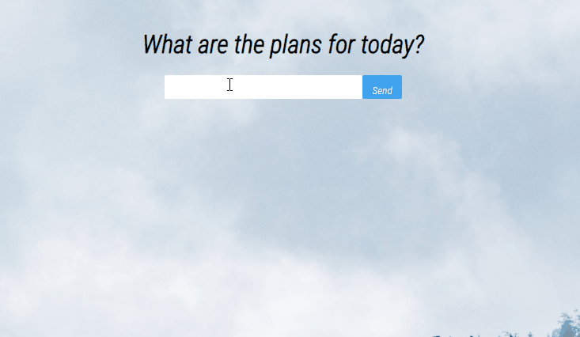

<h1 align="center">Todo List</h1>
<p align="center">
Record your daily tasks, edit and delete them.</p>


  

</br>

<p align="center">
 <a href="#about">About</a> •
 <a href="#features">Features</a> •
 <a href="#layout">Layout</a> • 
 <a href="#prerequisites">Prerequisites</a> • 
 <a href="#-technology">Technology</a> • 
 <a href="#-get-started">Get-Started</a> • 
 <a href="#-license">License</a> •
 <a href="#author">Author</a>
 </br></br>
 
</p>

<h4 align="center">
    Finished ✔
</h4>
</br>

### About


A simple project with an input that returns the tasks registered and when they were inserted. It is possible to edit and delete each one.
</br></br>

### Features

- [x] Receive information from the user and record the time.
- [x] Edit and delete what was inserted.
</br></br>

### Layout


</br>

</br>

### Prerequisites

Before starting, you will need to have the following tools installed on your machine:
[Git](https://git-scm.com) (to clone the project), [Node.js](https://nodejs.org/en/) (using npm for download all packs necessary for run the project) or [Yarn](https://yarnpkg.com/getting-started/install) (for de same reason of npm).

</br>

### 🛠 Technology

The following tools were used in the construction of the project:

- [Node.js](https://nodejs.org/en/)
- [React](https://pt-br.reactjs.org/)

</br>

### 🎲 Get-Started

```bash
# Clone this repository
$ git clone https://github.com/igoraraujocruz/todoList.git

# Access the project folder in the / cmd terminal
$ cd todoList

# run the command to download all the packages needed to run the application.
$ npm install

# if you are using Yarn, to do the same, use the command:
$ yarn

# Execute the application (depending on which package manager you are using)
$ npm start or yarn start 

# The application will start on port: 3000.
go to http://localhost:3000
```
</br></br>


## 📝 License

This project is under a license [MIT License](./LICENSE)
</br></br></br>


</br>

## Author
---

<a href="https://github.com/igoraraujocruz/">
 
 <br />
 <sub><b>Igor Araujo Cruz</b></sub></a> <a href="https://www.linkedin.com/in/igor-araujo-cruz-84a89111b/" title="Linkedin"></a>


Done with a lot of dedication and passion by Igor Araujo Cruz 👋🏽 
</br></br>
Contact

[](https://www.linkedin.com/in/igor-araujo-cruz-84a89111b/)
[](https://www.instagram.com/igoraraujocruzz/)
[](mailto:igoraraujocruzz@gmail.com)